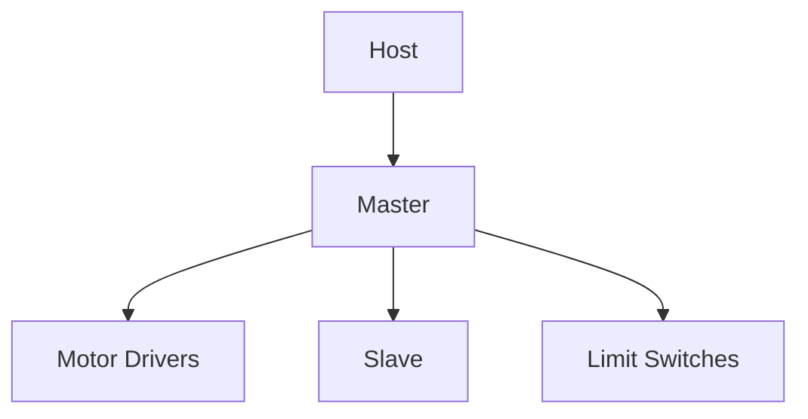
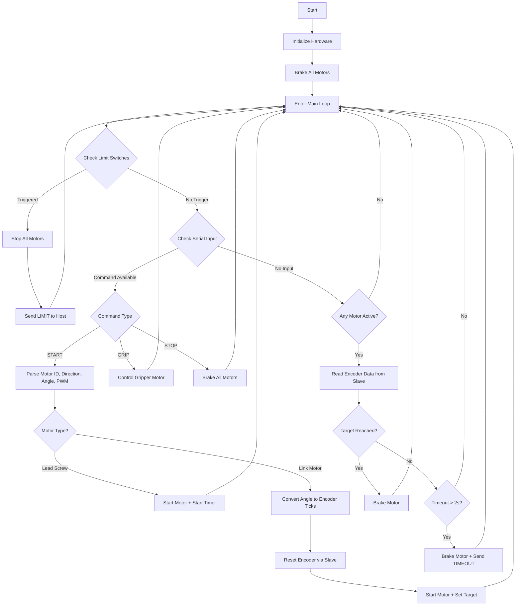
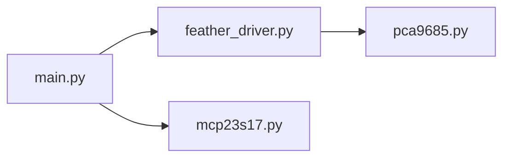

# 🧠 Master Controller (RPi Pico)

## 📌 Overview
Real-time execution + safety.

---

## 🧠 Architecture


## Flowchart

## File Interaction



---

## ⚙️ Responsibilities
- Serial commands
- PWM motor control
- Encoder feedback loop
- Limit detection

---

## ▶️ Run
- Flash MicroPython
- Upload files
- Run main.py

---

## 📁 File Structure
```plaintext
/src/master
├── main.py            # Core control loop (scheduler + logic)
├── feather_driver.py  # Motor driver abstraction (PCA9685 control)
├── mcp23s17.py        # SPI driver for limit switch expanders
└── pca9685.py         # Low-level PWM driver
```

## Platform and Specifications
- Thonny used for flashing code on Rasberry Pico
- Micropython used for master and slave RPi code ( Version MicroPython v1.25.0 )
- Python3 used for code for Teleop
- Communication protocols used : SPI , I2C and USB Serial ( UART over USB )
