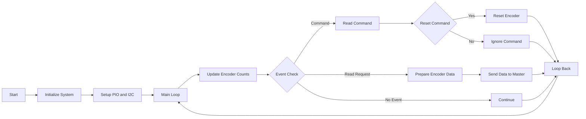

# ⚙️ Slave Encoder Coprocessor

## 📌 Overview
High-speed encoder tracking using PIO.

---

## 🧠 Architecture


---

# 🔁 **2. Slave Algorithm Flowchart**



## ⚙️ Features
- 8 encoders
- PIO-based counting
- I2C streaming

---

## ▶️ Run
- Flash MicroPython
- Upload files
- Run main.py

---

## 📂 Source Files & Structure
```plaintext
/src/slave
├── main.py              # Core loop (PIO + I2C handling)
├── i2c_responder.py     # Low-level I2C peripheral implementation
```

## Platform and Specifications
- Thonny used for flashing code on Rasberry Pico
- Micropython used for master and slave RPi code ( Version MicroPython v1.25.0 )
- Python3 used for code for Teleop
- Communication protocols used : SPI , I2C and USB Serial ( UART over USB )
