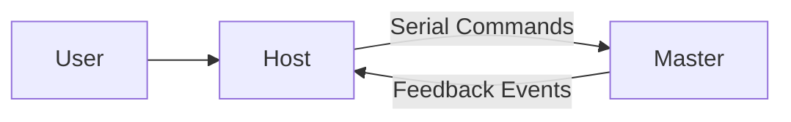
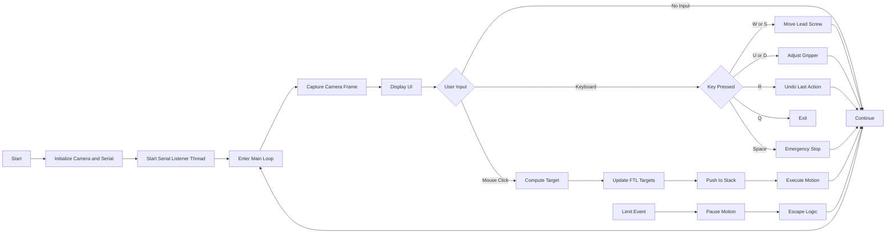

# Laptop Controller (pc_host.py)

## Overview
This module runs on the host PC and acts as the **Human-Machine Interface (HMI)** and high-level controller.

Responsibilities:
- User input (keyboard + mouse)
- Camera-based interface (OpenCV)
- Follow-The-Leader (FTL) trajectory planning
- Stack-based motion memory (undo)
- Communication with Master Pico via USB Serial
- Handling safety events (limit switches)

---

## System Role



---

## Control Flow



---

## Controls

| Input | Action |
|------|--------|
| Mouse Click | Add trajectory point |
| W / S | Move lead screw |
| U / D | Adjust gripper |
| R | Undo last action |
| SPACE | Emergency stop |
| Q | Quit |

---

## 🔌 Communication Protocol

### Commands Sent to Master
```
START,<motor_id>,<direction>,<angle>,<PWM>
GRIP,<direction>,<PWM>
S
```

### Messages Received from Master
```
LIMIT,<mcp_id>,<pin>
TIMEOUT,<motor>,<angle>,<direction>
```

---

## Running the Code

### Requirements
- Python 3.x
- OpenCV
- pyserial
- numpy

### Run
```bash
python pc_host.py
```

Make sure:
- Master Pico is connected via USB
- Correct camera index is set

---

## File Structure

```
/src/laptop
├── pc_host.py
├── README.md
```

---


---

## Experimental Controller (Controller.py)

An alternative control implementation (`Controller.py`) is included alongside `pc_host.py`.

### Purpose
This version was developed to extend functionality by:
- Supporting both keyboard and gaming controller input
- Enabling more flexible real-time control
- Exploring improved user interaction methods

---

## Control Modes
The system supports two input modes:
- Keyboard mode  
- Gaming controller mode  

### Mode Switching
| Input | Action |
|------|--------|
| T key | Switch from Keyboard to Controller |
| Controller button (configured) | Switch back to Keyboard |

---

## Keyboard Controls

| Key | Function |
|-----|----------|
| Mouse Click | Add trajectory point (FTL control) |
| W | Move lead screw forward |
| S | Move lead screw backward |
| U | Increase gripper tension |
| D | Decrease or release gripper |
| R | Undo last action |
| F | Toggle fullscreen |
| SPACE | Emergency stop |
| Q | Quit |

---

## Controller Inputs (Overview)

- Joystick axes control:
  - Lead screw motion (forward/backward) by Left Joystick
  - Gripper tension by L1 and R1
  - DOWN by A
  - RIGHT by B
  - LEFT by X
  - UP by Y

- Buttons control:
  - Directional movement (discrete steps)
  - Mode switching

---

## Testing Status

This file is not fully proof-tested.

- Core logic and functionality have been implemented  
- Basic features such as motion control, input handling, and communication have been tested  
- However, the system has not undergone extensive validation or edge-case testing  

This is due to time constraints during the repository submission phase.

---

## Recommendation

For stable operation and demonstrations, use `pc_host.py`.

`Controller.py` should be treated as an experimental implementation intended for further development and refinement.
## 📌 Notes
- Host performs **high-level planning only**
- All real motor control is handled by Master Pico
- Safety decisions (escape logic) are triggered from feedback
