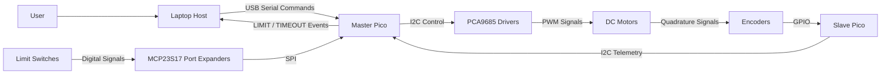
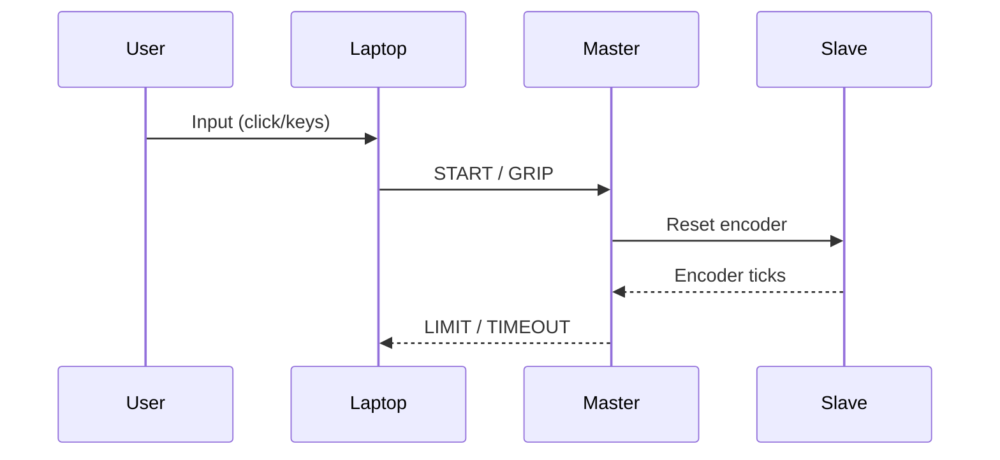

# Continuum Robot Control System

## Overview
A distributed control system for a tendon-driven continuum robot:
- **Laptop (Host)**: planning, UI, safety decisions
- **Master Pico**: real-time control, safety arbitration
- **Slave Pico**: high-speed encoder processing

---

## System Architecture


---

## Data Flow


---

## Project Structure
```
/Project-Root
├── src/
│   ├── Python_VSCode/
│   │   └── Teleop/
│   └── Micropython_Thonny/
│       ├── Master_RPi/
│       └── Slave_RPi/
```
## Step-by-step Execution Flow
- Load master code and Slave code to 2 different Rasberry Picos.
- Make the connections as given in the pcb section ( refer to the schematic and the guideline in PCB README.md ).
- Connect main Rasberry Pico to Laptop and run the main.py on master RPI.
- Run the code ( see the COM port connections for USB and Endoscope Camera ).
- Done! Now see Teleop README.md to find the commands.

## Platform and Specifications
- Thonny used for flashing code on Rasberry Pico
- Micropython used for master and slave RPi code ( Version MicroPython v1.25.0 )
- Python3 used for code for Teleop
- Communication protocols used : SPI , I2C and USB Serial ( UART over USB )
